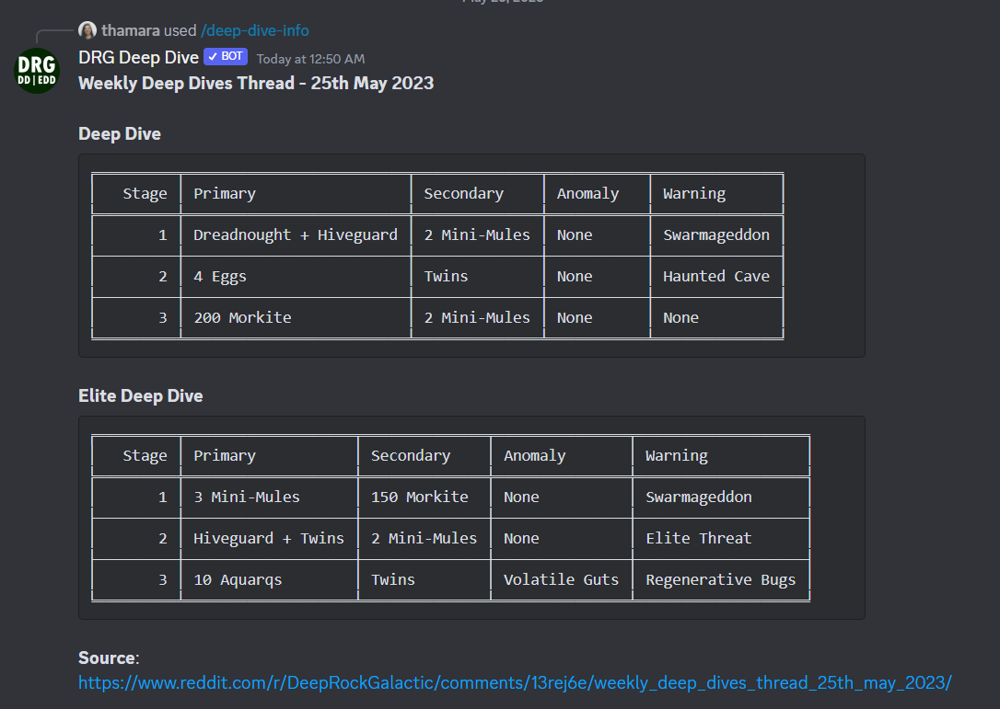

# Deep Rock Galactic Deep Dive Bot

DRG Deep Dive is a Discord bot that retrieves information from Reddit to show you what are this week's Deep Dive and Elite Deep Dive missions.



# Usage

[Install](https://discord.com/api/oauth2/authorize?client_id=894339506038247485&permissions=2147502080&scope=bot) bot on server and call it with `/deepdive`.

Alias commands: `/dd`, `/deep-dive`.

# Development

For testing and development, you need to create a new bot to be used for testing. Check this [page](https://discordpy.readthedocs.io/en/stable/discord.html) for information on how to do this.

**Hint**: Create a test server on discord where you can add the bot and test it.

You'll also need a token for Reddit's API. For this, head to [Reddit's preferences](https://www.reddit.com/prefs/apps), click `Create App`, give it a name, set type to `script`, and redirect uri as `http://www.example.com/unused/redirect/uri`. Click `Create App` and copy the Client ID (below the app name), and secret.

All the tokens from the previous steps will be included in the .env file.

1. Fork and clone this repository
2. Install the dependencies in `requirements.txt` in your python environment
3. Create a .env file in the root directory with:
```
REDDIT_CLIENT_ID=<REDDIT CLIENT ID>
REDDIT_SECRET=<REDDIT SECRET>
TOKEN=<DISCORD BOT TOKEN>
```
4. Run `python main.py`
5. You can use the command `/deep-dive-raw` to retrieve the thread without parsing.

# Credits

All the information is taken from Reddit [r/DeepRockGalactic](https://www.reddit.com/r/DeepRockGalactic/).